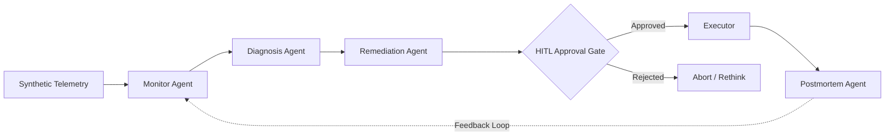
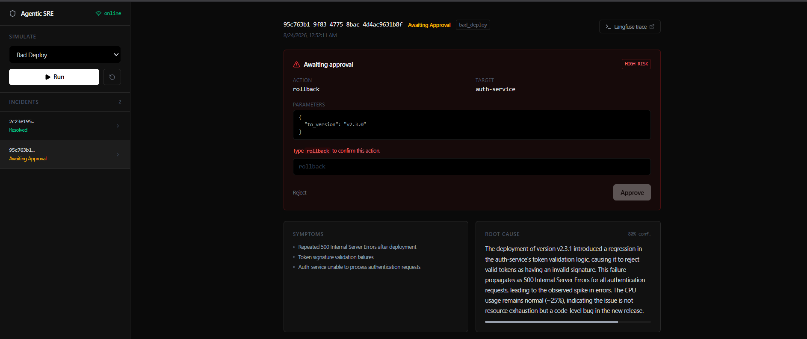
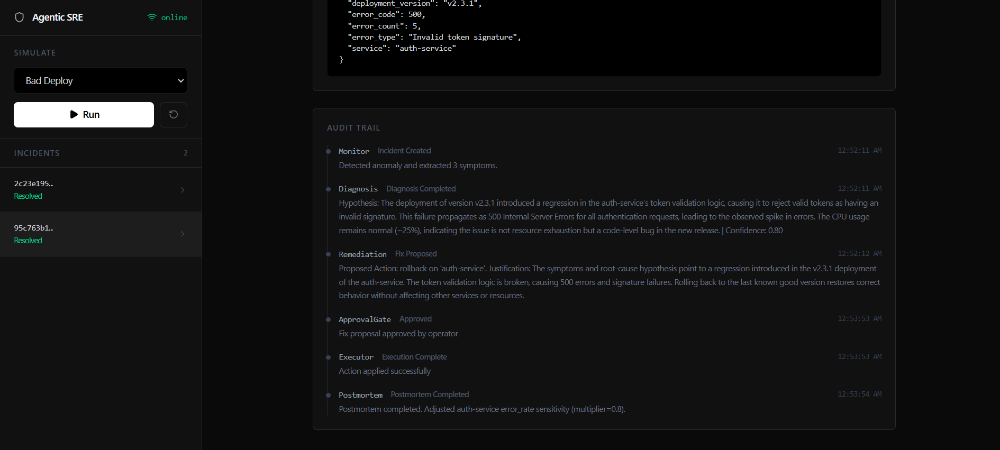
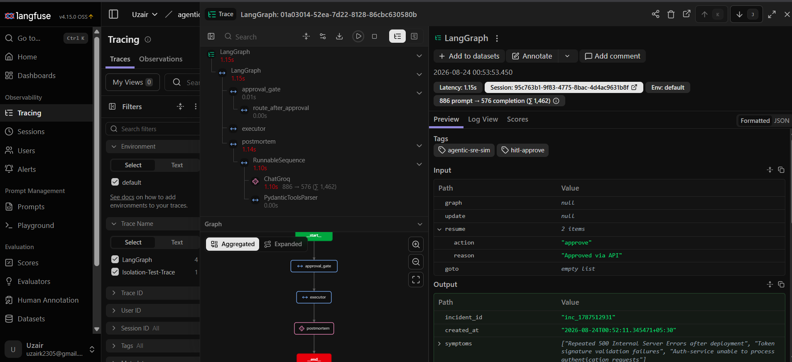

# Agentic-SRE: Multi-Agent Autonomous Incident Response


An autonomous multi-agent pipeline that detects, diagnoses, and proposes remediations for production incidents in seconds. Built with strict human-in-the-loop (HITL) guardrails, automated LLM evaluations, and closed-loop learning.

## The Problem & Solution

When production systems fail, on-call engineers typically spend the critical first 20 minutes of an outage just sifting through logs, dashboards, and alerts to figure out *what* broke and *why*. 

Agentic-SRE compresses that investigation time from minutes to seconds. It autonomously analyzes synthetic telemetry to identify anomalies, formulates a root cause hypothesis, and proposes a remediation plan. Most importantly, it guarantees safety by explicitly preventing the AI from executing any high-risk or destructive actions without typed, human-in-the-loop approval.

## Architecture



## Core Features 

**Strict Guardrails**  
High-risk actions (like deployments or rollbacks) require explicit, typed confirmation from a human operator. Prompt injections and unsafe inputs are structurally blocked at the pipeline edge.  


**Closed-Loop Learning**  
The system learns from every incident. The Postmortem Agent dynamically updates detection thresholds (`thresholds.json`) after an incident is resolved, teaching the Monitor Agent to catch similar regressions faster in the future.  


**Automated Evals (CI/CD)**  
A custom evaluation harness runs the entire pipeline against a golden dataset of synthetic incidents. The CI build is configured to fail automatically if the AI's diagnostic accuracy regresses below 75%.

**Full Traceability**  
Every LLM token, prompt, and tool call is captured and correlated. If the AI makes a mistake, you have the full reasoning trace to debug and improve the prompt heuristics.  


## Quick Start Guide

**Step 1: Start the Observability Stack**  
Start the self-hosted Langfuse and Postgres instances using Docker.
```bash
docker compose up -d
```

**Step 2: Backend Setup**  
Navigate to the backend directory, configure your environment variables, and start the FastAPI server.
```bash
cd backend
# Create a .env file with your GROQ_API_KEY and Langfuse keys
pip install -r requirements.txt
uvicorn api.main:app --reload
```

**Step 3: Frontend Setup**  
Navigate to the frontend directory, install dependencies, and start the Vite development server.
```bash
cd frontend
npm install
npm run dev
```

## Tech Stack

*   **Orchestration:** LangGraph, LangChain
*   **Backend:** FastAPI, Python, Pytest
*   **Frontend:** React, TypeScript, Tailwind CSS, Vite
*   **Observability:** Langfuse (Self-Hosted via Docker)
*   **Inference:** Groq API (Llama 3)
